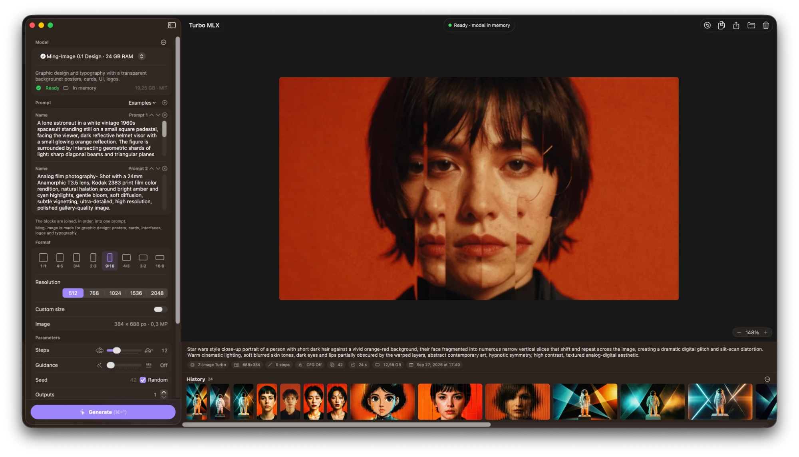

# Turbo MLX: AI Image & Video Generation for Apple Silicon

**[⬇ Download the latest version](https://github.com/rinste/turbo-mlx/releases/latest)**: a disk image
for Macs with Apple silicon and macOS 15 or later. Open it and drag Turbo MLX to Applications.

A macOS app (SwiftUI) that generates images, and videos with sound, on the Mac's GPU with MLX.
It is built to be distributed: the people who install it never open Terminal and need neither Python nor Xcode. The
engine is part of the app, written in Swift on MLX; on first launch the user picks a model, the
app downloads it, and that is all the setup there is.



- **Left column:** the prompt as blocks (Subject and Style to start with, each one a piece of the
  final text; renamable, resizable, and put in order by dragging), aspect ratio, steps and guidance;
  under *Advanced*, the resolution or a custom size, seed, number of images, transparent or white
  background, memory saving, a *16-bit precision* for Z-Image and the Qwen-Image models (faster,
  with slightly different fine detail) and the *Live preview*, which shows the image as it forms
  every few steps. For LTX-2.3 and LTX-2.5, FLUX.2 Klein, Qwen-Image Edit and SenseNova-U1.5, a
  *Reference Image* above the prompt (dropped from Finder or from the history, chosen from a file
  or among the generated images): the clip's first frame, or the picture the image models change
  as the prompt says ("make it winter"), in its own proportions (Qwen-Image Edit needs one). For a clip,
  its duration and frame rate; LTX-2.5 can instead pick the length the prompt describes, up to the
  longest set. With the SeedVR2 upscaler, no prompt and no format: the *Picture to
  Upscale*, its scale (2×, 3× or 4× each side, up to 4096 × 4096 pixels), a *Softness* that
  shrinks a noisy or over-sharpened picture first, and the size it comes out at; *Upscale…*, in the
  menu of any image, sets one up. At the bottom, on a darker tray, *Model:* and its picker (upscale,
  image and video models in three groups, each with the memory it wants on a small dark badge; an icon tells the
  models that also take a reference image, a picture, from those that work from the prompt alone,
  lines, with a small arrow while one is not downloaded; then its status) above the main button,
  which does
  what the current state needs: *Download and Generate* → *Generate*, with how long it should take
  (judged from this Mac's earlier generations with the model, e.g. *Generate (~4 min · ⌘↩)*).
  *Reset*, next to the model, goes back to the default model and settings with an empty prompt (⌘Z
  brings them back). Seeds are random by default, with every model.
- **Right column:** the image (on a checkerboard when transparent) or the clip (playing in a loop
  while the app is in front, with the sound as last set; a click on it or space pauses or plays it,
  the controls under the picture), with its prompt (a long one scrolls) and metadata, the running
  generation with its model, progress and time left (for a clip too, counted by its steps' expected
  time), and the history: by date, the oldest on the left and the newest on the right, or in your
  own order (drag an image or clip where you want it; the menu next to *History* switches between
  the two, and new ones join the end), then the queue; a *+*, always at the right end of the strip however far it is scrolled, is the draft of the next generation: its settings on the left (the last generation's, the first
  time), its frame on the right, for Generate to start. What is changed there stays, even across
  launches, while you look through the history. A click on an image or clip, or on a generation
  running or waiting in the queue (or ← →, ⌘[ ⌘]), shows it and puts its prompt, in its blocks, its
  model and its settings in the left column, with a random seed; ⌘Z brings back what was there. A
  queued one says when it starts, and a running one stays in view as its result once done. Zoom:
  pinch, the mouse wheel, double-click, ⌘-scroll, the − % + controls or the View menu (⌘+, ⌘-, ⌘0
  actual size, ⌘9 fit); two-finger scroll (⌥-wheel with a mouse) or drag to move around. Drag and
  drop, copy.

## Install

Download the disk image from [Releases](https://github.com/rinste/turbo-mlx/releases), open it and
drag Turbo MLX to Applications. It needs a Mac with Apple silicon, macOS 15 or later, 16 GB of
memory for the lightest models (each model's needs are in the table below) and room on the disk
for the models you pick, 5 to 38 GB each.

On first launch, pick a model and click *Download and Generate*: the model downloads once from
Hugging Face into `~/.cache/huggingface`, where mflux and other tools find it too, and stays there
(Settings → Models can keep the models in another folder, on an external disk for instance).
A download resumes where it stopped, tries again by itself when the network drops, and keeps the
Mac from going to sleep while it runs. *Move to Trash…*, in the ⋯ menu next to the model or in
Settings → Models, takes a model off the disk again.

New versions install themselves: once a day the app looks for one on GitHub and, when you agree,
downloads it, checks its signature and restarts with it (Settings → About can also let it do so
without asking, or turn the checks off; Turbo MLX → Check for Updates looks at any time). Versions
before 1.1 only point to the download page.

Prompts, images and videos never leave the Mac: besides the model downloads, the app only asks
GitHub whether a newer version is out.

Every image and clip says in its metadata that it was made with AI, in the form machines read
(IPTC's Digital Source Type in XMP, which the EU AI Act asks of generated media): *Created using
Generative AI* from a prompt, *Edited using Generative AI* when a picture was changed, animated
or upscaled, unless that picture was itself made with AI. A PNG keeps it in its XMP next to the
prompt and settings, an MP4 in an XMP box.

## Models

| Model | Memory | Download | Peak at 1024 px | Notes |
|---|---|---|---|---|
| [Ming-Image 0.1 Design](https://huggingface.co/joeynyc/Ming-Image-0.1-Design-mflux-q8-te5) | 24 GB | 19.3 GB | 14.7 GB | graphic design and typography, PNG with alpha · 12 steps · MIT |
| [Z-Image Turbo](https://huggingface.co/mflux-community/z-image-turbo-mflux-q4) | 16 GB | 5.9 GB | 8.5 GB | photorealism, text in the image · 4-bit · 9 steps · Apache 2.0 |
| [Z-Image Turbo](https://huggingface.co/mflux-community/z-image-turbo-mflux-q8) | 24 GB | 11 GB | ~13.6 GB | the 8-bit version, closer to the original |
| [FLUX.2 Klein 4B](https://huggingface.co/mflux-community/flux2-klein-4b-mflux-q4) | 24 GB | 4.6 GB | 14.1 GB | the fastest: 4 steps; edits a reference image as the prompt says · Apache 2.0 |
| [Qwen-Image 2512](https://huggingface.co/mflux-community/qwen-image-2512-mflux-q4) | 32 GB | 27.6 GB | 21.3 GB | 20B, rich scenes and long text · 4-bit · 20 steps · Apache 2.0 |
| [Qwen-Image Edit 2511](https://huggingface.co/mflux-community/qwen-image-edit-2511-mflux-q4) | 32 GB | 29 GB | 33 GB (672 × 880, without *Save memory*) | changes a reference picture as the prompt says and keeps the rest · 20B, 4-bit · 20 steps · Apache 2.0 |
| [SenseNova-U1.5](https://huggingface.co/mlx-community/SenseNova-U1.5-8B-MoT-8step-4bit) | 16 GB | 11.8 GB | 11.6 GB, 6.9 GB with *Save memory* | photos, posters and infographics with legible text, in pixels (no VAE); edits a reference image as the prompt says · 8B + 8B, 4-bit · 8 steps · Apache 2.0 |
| [LTX-2.3](https://huggingface.co/dgrauet/ltx-2.3-mlx-q4) | 32 GB | 28.5 GB | 18 GB (768 × 512, 5 s) | video with sound, from a prompt or from an image as the first frame · 22B distilled, 4-bit · 8 + 3 steps · LTX-2 Community |
| [LTX-2.3](https://huggingface.co/dgrauet/ltx-2.3-mlx-q8) | 64 GB | 37.8 GB | 37 GB (768 × 512, 5 s) | the 8-bit version, closer to the original |
| [LTX-2.5](https://huggingface.co/dgrauet/ltx-2.5-mlx-q4) | 32 GB | 28.8 GB | 19 GB (768 × 512, 5 s) | Lightricks' newer model: video with sound, several shots in one prompt, from a prompt or an image · 22B distilled with its own Gemma 4, 4-bit · 8 + 3 steps · LTX-2 Community, gated: accept its terms on Hugging Face |
| [SeedVR2 Upscaler 3B](https://huggingface.co/numz/SeedVR2_comfyUI) | 16 GB | 7.3 GB | 11 GB (to 2304 × 2304), 18 GB (to 4096 × 4096) | enlarges a picture 2–4× with sharper, faithful detail, in one step, no prompt · float16 · Apache 2.0 |

Measured on an M1 Max with mflux 0.20, the Python reference the native engine is checked against
(the 8-bit Z-Image peak adds its larger weights to the measured 4-bit one). A model is listed under
the smallest common Mac memory size it peaks under 80% of. Times at 1024 × 1024: FLUX.2 Klein ~30 s
(editing a reference image, about 40 s at 1024 × 640: its tokens join the image's), Z-Image Turbo
4-bit ~100 s; Ming-Image takes 76 s at 1024 × 576. The model stays loaded between images. LTX-2.3 is
measured with the native engine against dgrauet's [ltx-2-mlx](https://github.com/dgrauet/ltx-2-mlx),
with *Save memory*: a 5-second 768 × 512 clip with sound takes about 3½ minutes (206 s), a 3-second
one from an image 122 s; the 8-bit version, without *Save memory* as on a 64 GB Mac, takes
3.6 minutes (219 s) for the same 5 seconds. LTX-2.5, checked the same way, takes 197 s with
*Save memory* for that clip (216 s for 640 × 640 without it, peaking at 34 GB). Qwen-Image Edit reads the picture's tokens next to the image's in
both passes of every step: a 672 × 880 edit in 20 steps took 12.4 minutes with mflux and about 15 with
the native engine (measured while the Mac was busy building), whose image matched mflux's to 68 dB.
SenseNova-U1.5 is measured with the native engine against SenseTime's own PyTorch code, run on
the same weights: 1024 × 1024 in 28–31 s, 512 × 512 in 7 s, 2048 × 2048 in 2½ minutes, with
images that match the reference's to 37 dB at 512 px and 29 dB at 1024 px (a model this
sensitive drifts as far from itself when its noise changes by 0.2%). An edit reads the picture
with the prompt, at about the image's size: 34 s at 1024 × 1024, matching the reference's to
37 dB (44 dB at 512 px).
SeedVR2 encodes and decodes the picture in tiles and runs its transformer once, attending within
windows: 672 × 880 to 1344 × 1760 takes 29 s (mflux 51 s, peaking at 18 GB), 768 × 768 to
2304 × 2304 41 s at 11 GB, to 4096 × 4096 about 2 minutes at 18 GB; its images match mflux's to
57–62 dB.

Ming-Image comes in one version (te5): at 1024 px its memory peak is set by the DiT, which is the
same in every conversion, and te6/te8 give the same images as te5 with more memory. Qwen-Image
3.0 has no public weights (it only runs on Alibaba's platform), so Qwen-Image 2512 is the latest
Qwen model here, with Qwen-Image-Edit 2511 for editing; Qwen-Image 2.1 is newer but licensed for
non-commercial use only.

Peaks are with *Save memory* on, the default below 64 GB; without it Ming-Image peaks at ~35 GB
and Qwen-Image at ~43 GB. Before a generation starts, the app compares what it should need with
this Mac's memory (less 2.5 GB for macOS and the app), from peaks measured for every model at
several sizes and clip lengths (`TurboMLX/Models/MemoryEstimate.swift`): one that cannot fit is
refused, with what would make it fit (*Save memory*, a smaller size or a shorter clip, another
model), instead of starting and taking the engine down when the GPU runs out.
More mflux checkpoints of the same families can be added from
**⋯ → Add Model…** (Hugging Face repository or local folder; for Klein you can pick the 4B/9B/base
variant).

## Development

Requirements: an Apple silicon Mac, macOS 15 or later, Xcode 26.

```bash
open TurboMLX.xcodeproj
```

Then ⌘R in Xcode. The app's build also builds the native engine from `Engine/` and embeds it
(the *Embed turbo-engine* phase, `scripts/embed-engine.sh`): the first build takes a few minutes
for MLX's C++ core and Metal kernels, the next ones seconds, since the engine is only rebuilt when
`Engine/` changed. The app cannot generate without it, so when the engine does not build, neither
does the app.

Builds are signed ad hoc unless `Signing.local.xcconfig`, a file next to `Signing.xcconfig` that
git ignores, names a team and its certificate (`DEVELOPMENT_TEAM`, `CODE_SIGN_IDENTITY =
Developer ID Application`). With a Developer ID every build keeps the app's data: the sandbox ties
the container to the signature, and an ad hoc one changes with every build, so macOS may keep a
new build out of the data an older one left. The script that builds a release,
`scripts/release.sh`, explains in its header how to set up notarization and publish a version.

The project has a second target, *TurboMLX Sealed*: the same sources compiled with `SEALED`, a
build that does not update itself (no Sparkle) and has no sandbox exception
(`TurboMLX-Sealed.entitlements`), with an Info.plist of its own and its models in the app's
container unless Settings → Models points it to another folder, `~/.cache/huggingface` included.
Both builds carry `Resources/PrivacyInfo.xcprivacy`.

To try the first-run experience without touching your real history, point the app at an empty
data folder in its container (`~` is the container's home there, hence the quotes):

```bash
open -n --env TURBO_MLX_HOME='~/first-run' "path/to/Turbo MLX.app"
```

## How it works

```
SwiftUI ── JSON lines (stdin/stdout) ──▶ turbo-engine serve ──▶ MLX Swift (GPU)
```

- **Engine.** `Engine/` is a Swift package that runs every family of the catalog (FLUX.2 Klein,
  Z-Image Turbo, Qwen-Image 2512 and Qwen-Image-Edit 2511, Ming-Image from mflux's checkpoints,
  SenseNova-U1.5 from mlx-community's, LTX-2.3 and LTX-2.5 from dgrauet's, the SeedVR2 upscaler from its
  original one) on MLX Swift. The app's
  build embeds its `turbo-engine` binary in the bundle (`Contents/MacOS`, signed with the app),
  and every model runs there: nothing is installed on first launch, the engine starts in an
  instant, and no Python process sits between the app and the GPU. The engine keeps the
  selected model in memory, loads it as soon as a prompt is being written, encodes the prompts
  of the queued images while the text encoder is in memory, reports phases, per-step progress
  and the seconds each phase took (shown when hovering the time of an image), shows the image as
  it forms (the model's prediction decoded small every few steps), and stops a generation at the
  next step. See `Engine/README.md` and
  [docs/native-engine.md](docs/native-engine.md).
- **mflux is the reference.** The ports follow [mflux](https://github.com/mflux-community/mflux)
  (Python + MLX) module for module: `Engine/Fixtures` builds the references `verify` compares
  each stage against, and `Engine/Reference/turbo_worker.py`, the Python engine the app used to
  ship, runs a real checkpoint through mflux behind the same protocol, to compare the images.
  Neither is part of the app. SenseNova-U1.5, which mflux does not run, follows SenseTime's own
  PyTorch code the same way (`Engine/Fixtures/make_sensenova_fixture.py`,
  `Engine/Reference/sensenova_reference.py`).
- **Save memory.** Frees the text encoder of Ming-Image, Qwen-Image and Qwen-Image Edit (and the
  half of SenseNova-U1.5 that reads the prompt) once the prompt is read (a new prompt reloads
  only the text side, with the transformer released first, so the two are never in memory
  together), decodes the image in tiles where the VAE allows it (not FLUX.2, whose tiles would
  show seams), and keeps MLX's buffer cache small.
- **Downloads.** The app downloads models itself (`Services/HubDownloader.swift`) into the
  Hugging Face cache, in the same layout huggingface_hub uses, so mflux and other tools share
  them. Each catalog model comes at the commit it was checked with (`revision` in
  `Models/ModelCatalog.swift`), so a change upstream never reaches the app untested: move a
  revision forward only after generating with the model at the new commit. An interrupted
  download resumes; a transfer the network cuts off is tried again for about two minutes before
  the download fails; the Mac stays awake while a download or the generation queue runs
  (`Services/KeepAwake.swift`). A download first checks the disk has room for what is still
  missing, and fails aloud when the files that arrived are not a complete model. No engine is
  needed to download. A gated or private repository uses the token the Hugging Face CLI saved
  (`hf auth login`).
- **Updates.** [Sparkle](https://sparkle-project.org) (`Services/AppUpdater.swift`) reads the
  `appcast.xml` attached to the latest GitHub release (`SUFeedURL` in `TurboMLX-Info.plist`). An
  update is installed only if its EdDSA signature matches the public key in that file,
  `SUPublicEDKey`, and it is signed with the same Developer ID; Sparkle's installer service, which
  the sandbox lets the app reach through two `mach-lookup` exceptions in `TurboMLX.entitlements`,
  replaces the app and relaunches it. `scripts/release.sh` writes each release's feed with
  `scripts/make-appcast.sh`, signing it with the private key that Sparkle's `generate_keys` put in
  the maintainer's keychain. Keep a copy of that key (`generate_keys -x <file>`, then somewhere
  safe): an update signed with any other key is refused by every copy of the app already out there.
  Sparkle compares build numbers, so `CURRENT_PROJECT_VERSION` must grow with every release.
- **Sandbox.** The app runs in the App Sandbox (`TurboMLX.entitlements`): its history and
  settings live in its container, and outside it the app reaches only `~/.cache/huggingface`,
  the folder the Hugging Face CLI and mflux use by default, through an entitlement for that path
  (an `HF_HOME` elsewhere is not followed). The engine inherits the sandbox. A folder picked for
  a local model is kept with a security-scoped bookmark (`Services/FolderAccess.swift`), opened
  before the engine starts so it can read it too. The first sandboxed launch moved the history
  and the settings from their old places into the container
  (`Resources/container-migration.plist`). The entitlement for `~/.cache/huggingface` is a
  temporary exception; the sealed build (`TurboMLX-Sealed.entitlements`) has none and keeps its
  models in the container instead, or in a folder the user picks, reached like a local model's
  through a security-scoped bookmark (`Services/ModelFolder.swift`), which the GitHub build can
  use too. The Hugging Face token, for gated repositories only, can be saved in Settings →
  Models, in the keychain; the GitHub build also reads the one the huggingface CLI saved.

| What | Where |
|---|---|
| History (PNGs, MP4s + `history.json`) | `~/Library/Containers/io.github.rinste.TurboMLX/Data/Library/Application Support/TurboMLX/History` |
| Models | `~/.cache/huggingface/hub`, or the folder chosen in Settings → Models; sealed build: `…/Containers/io.github.rinste.TurboMLX/Data/Library/Application Support/TurboMLX/Models/hub` |

```
TurboMLX/
  App/        entry point, AppModel (queue, engine events, selection, persistence)
  Models/     catalog and families, settings, jobs, history items
  Services/   the engine process, downloads, Hugging Face cache, history
  Views/      left column, output, history, settings, log
Engine/       the engine (Swift package: turbo-engine, TurboEngineCore), its fixtures, the
              mflux reference worker and the licenses of the projects its ports follow (Licenses/)
scripts/      release.sh, embed-engine.sh, build-engine.sh, ExportOptions.plist, make-icon.swift
              (draws the app icon at every size into the asset catalog), make-acknowledgements.swift
              (the licenses Settings → About shows: Resources/Acknowledgements.txt), make-appcast.sh
              (a release's Sparkle feed)
TurboMLX.entitlements   the app's sandbox (the engine's: Engine/turbo-engine.entitlements)
Signing.xcconfig        how local builds are signed (the team goes in Signing.local.xcconfig)
TurboMLX-Info.plist     the Info.plist keys Xcode cannot generate: Sparkle's feed and public key
```

The project uses Xcode's synchronized folders: files added under `TurboMLX/` join the target on
their own.

**Adding a model family:** a case in `ModelFamily` (`Models/ModelCatalog.swift`: download
patterns, components, steps, guidance), a `FamilyModel` under `Engine/Sources/TurboEngineCore/Families/`
with its fixture and `verify` stage (see `Engine/README.md`), and an adapter in `FAMILIES` in
`Engine/Reference/turbo_worker.py` to compare real images with mflux.

**Where this is going:** [docs/native-engine.md](docs/native-engine.md) is the case for the
native engine, what is checked so far, and what comes next.
[docs/generation-performance.md](docs/generation-performance.md) ranks the ways to make generation
faster, with the measurements that decide each one.
[docs/swift-engine-plan.md](docs/swift-engine-plan.md) takes stock of the native engine (where it
loses time, what still needs Python, its dependencies) and plans what follows: efficiency, fewer
dependencies, a sealed build.

## Troubleshooting

- **Engine Log** (⌥⌘L): what the engine prints, warnings included.
- Settings (⌘,) → Engine: the engine's versions and executable, restart.

## License

Turbo MLX is released under the [MIT License](LICENSE). The models it downloads come with their
own licenses, listed in the table above and in Settings → About; the libraries built into the app
and the projects its engine follows, in Settings → About → Acknowledgements.
