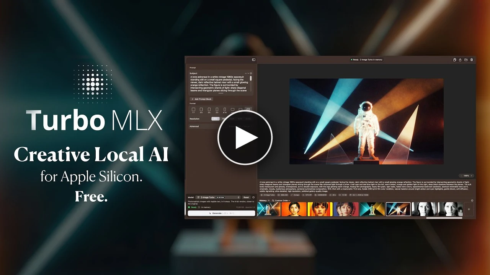

# Turbo MLX: AI Image & Video Generation for Apple Silicon

**[⬇ Download the latest version](https://github.com/rinste/turbo-mlx/releases/latest)**: for Macs
with Apple silicon (M1 or later) and macOS 15 or later.

Turbo MLX turns a few words into images, and into short videos with sound, right on your Mac.
There is nothing else to install: no Terminal, no Python, no account. Pick a model, the app
downloads it once, and you can start. Everything runs on the Mac's own graphics chip, so your
prompts and pictures never leave it.

[](https://www.youtube.com/watch?v=qjuIjDraq10)

*Click the picture to watch the video on YouTube.*


## What you can do

- **Create images** from a description: photos, posters, graphic design, text inside the picture.
- **Edit a picture** by saying what to change ("make it winter"): the rest stays as it was.
- **Make short videos with sound**, from a description or starting from a picture.
- **Upscale** a picture 2, 3 or 4 times, with sharper detail.

## Getting started

1. [Download the disk image](https://github.com/rinste/turbo-mlx/releases/latest), open it and
   drag Turbo MLX to Applications.
2. Open the app, pick a model at the bottom left and click **Download and Generate**. Not sure
   which one? *Z-Image Turbo* runs on any Mac with 16 GB; *FLUX.2 Klein* is the fastest with 24 GB.
3. Describe what you want to see and press **Generate** (⌘↩).

Each model downloads only once and stays on the Mac: 5 to 38 GB, depending on the model (see
[Models](#models)). A download that stops picks up where it left off, and the Mac stays awake
until it is done. To free the space again, use *Move to Trash…* in the ⋯ menu next to the model.

**You need** a Mac with Apple silicon, macOS 15 or later, at least 16 GB of memory (the bigger
models want more, see the table) and room on the disk for the models you pick.

## Using the app

### On the left: what to make

- **The prompt.** You write it in blocks, *Subject* and *Style* to start with, which join into
  one text. Add more, rename them, resize them, drag them into another order.
- **Shape and size.** The aspect ratio and the resolution (a bigger picture takes longer) and,
  for the models that use it, *Guidance*: how closely the picture follows the prompt.
- **A starting picture.** Models that can use one show a *Reference Image* box above the prompt:
  drop a picture there from Finder or from the history. Image models change it as the prompt
  says; video models use it as the first frame of the clip. Qwen-Image Edit always needs one.
- **Videos.** Choose the duration and the frame rate, or let LTX-2.5 pick the length the prompt
  describes.
- **Upscaling.** With the SeedVR2 upscaler there is no prompt: pick the picture, the scale and,
  for a noisy or over-sharpened picture, some *Softness*. *Upscale…*, in the menu of any image,
  sets it up for you.
- **Advanced**, for when you want more control: a custom size, the number of steps (more is
  slower, often finer), the seed (random by default), several images at once, a transparent or white background, *Save memory*, the
  *Live preview* (the image shown as it forms) and *16-bit precision* for Z-Image and Qwen-Image
  (an experiment: different details, no faster on an M1).
- **Model and Generate**, at the bottom. The model picker groups upscale, image and video models
  and shows how much memory each one needs; an icon marks the ones that take a picture, a small
  arrow the ones not downloaded yet. The big button tells how long the next generation should
  take on your Mac, judged from your earlier ones: *Generate (~4 min · ⌘↩)*. *Reset* goes back to
  the default settings with an empty prompt; ⌘Z undoes it.

### On the right: the results

- **The picture or the clip**, with its prompt and details underneath. A clip plays in a loop
  while the app is in front; click it or press Space to pause. Transparent images sit on a
  checkerboard.
- **While it generates:** progress, time left and, with *Live preview*, the image taking shape.
- **The history**, a strip along the bottom: oldest on the left, newest on the right, or in your
  own order (drag a picture where you want it; the menu next to *History* switches between the
  two). Waiting generations queue up after it.
- **Going back to an earlier one:** click it (or use ← →) to see it again. Its prompt, model and
  settings return to the left column, with a new seed, so you can make variations; ⌘Z restores
  what you had there before.
- **The + at the end of the strip** is the next generation you are preparing. What you change
  there is kept, even after quitting, while you look through the history.
- **Taking a picture out:** drag it to Finder or another app, or copy it.

### Keyboard and mouse

| To | Do |
|---|---|
| Generate | ⌘↩ |
| See the previous or next item | ← → or ⌘[ ⌘] |
| Pause or play a clip | Space, or click it |
| Zoom | pinch, mouse wheel, ⌘-scroll, ⌘+ ⌘−, the − % + controls |
| Zoom in on a point and back | double-click |
| Actual size / fit to the window | ⌘0 / ⌘9 |
| Move around a zoomed picture | drag, two-finger scroll (⌥-wheel with a mouse) |
| Undo a change to the settings | ⌘Z |
| Settings / Engine Log | ⌘, / ⌥⌘L |

## Models

*Minimum RAM* is the memory your Mac needs for the model; *Download* is the space it takes on
the disk.

| Model | Minimum RAM | Download | Good for |
|---|---|---|---|
| [Ming-Image 0.1 Design](https://huggingface.co/joeynyc/Ming-Image-0.1-Design-mflux-q8-te5) | 24 GB | 19.3 GB | graphic design and typography, PNG with a transparent background · 12 steps · MIT |
| [Z-Image Turbo](https://huggingface.co/mflux-community/z-image-turbo-mflux-q4) | 16 GB | 5.9 GB | photorealism, text in the image · 4-bit · 9 steps · Apache 2.0 |
| [Z-Image Turbo](https://huggingface.co/mflux-community/z-image-turbo-mflux-q8) | 24 GB | 11 GB | the 8-bit version, closer to the original |
| [FLUX.2 Klein 4B](https://huggingface.co/mflux-community/flux2-klein-4b-mflux-q4) | 24 GB | 4.6 GB | the fastest: 4 steps; also edits a picture as the prompt says · Apache 2.0 |
| [Qwen-Image 2512](https://huggingface.co/mflux-community/qwen-image-2512-mflux-q4) | 32 GB | 27.6 GB | rich scenes and long text · 20B, 4-bit · 20 steps · Apache 2.0 |
| [Qwen-Image Edit 2511](https://huggingface.co/mflux-community/qwen-image-edit-2511-mflux-q4) | 32 GB | 29 GB | changes a picture as the prompt says and keeps the rest · 20B, 4-bit · 20 steps · Apache 2.0 |
| [SenseNova-U1.5](https://huggingface.co/mlx-community/SenseNova-U1.5-8B-MoT-8step-4bit) | 16 GB | 11.8 GB | photos, posters and infographics with legible text; also edits a picture as the prompt says · 8B + 8B, 4-bit · 8 steps · Apache 2.0 |
| [LTX-2.3](https://huggingface.co/dgrauet/ltx-2.3-mlx-q4) | 32 GB | 28.5 GB | video with sound, from a prompt or from a picture as the first frame · 22B, 4-bit · LTX-2 Community |
| [LTX-2.3](https://huggingface.co/dgrauet/ltx-2.3-mlx-q8) | 64 GB | 37.8 GB | the 8-bit version, closer to the original |
| [LTX-2.5](https://huggingface.co/dgrauet/ltx-2.5-mlx-q4) | 32 GB | 28.8 GB | Lightricks' newer model: video with sound, several shots in one prompt, from a prompt or a picture · 22B, 4-bit · LTX-2 Community, gated: accept its terms on Hugging Face |
| [SeedVR2 Upscaler 3B](https://huggingface.co/numz/SeedVR2_comfyUI) | 16 GB | 7.3 GB | enlarges a picture 2–4× with sharper, faithful detail, up to 4096 × 4096, no prompt · Apache 2.0 |

**Which one?** For a first try, Z-Image Turbo (4-bit) or SenseNova-U1.5, which both run on 16 GB.
For quick ideas, FLUX.2 Klein. For logos, layouts and lettering, Ming-Image. For crowded scenes
and long text, Qwen-Image 2512, if you have time to wait. To edit a picture: FLUX.2 Klein in
seconds, SenseNova-U1.5, or Qwen-Image Edit, the slowest but the one that touches the least
besides what you asked. For video, LTX-2.5.

More checkpoints of the same families can be added from **⋯ → Add Model…** (a Hugging Face
repository or a local folder; for Klein you can pick the 4B, 9B or base variant).

## How fast is it?

Times on the author's Mac, an **M1 Max with 64 GB**, from runs already made: the engine's
benchmark of 30 September 2026 and the app's own history. They count from *Generate* to the
finished picture, with the model already loaded (the first generation after choosing a model
adds a few seconds to load it).

| Model | What | Time |
|---|---|---|
| FLUX.2 Klein 4B | image, 512 × 512 | 9 s |
| FLUX.2 Klein 4B | image, 1024 × 1024 | 27 s |
| FLUX.2 Klein 4B | edit a 640 × 512 picture | 17 s |
| Z-Image Turbo 4-bit | image, 1024 × 1024, *Save memory* | 1½ min |
| Z-Image Turbo 8-bit | image, 768 × 768 | 52 s |
| Ming-Image 0.1 Design | image, 512 × 512, *Save memory* | 37 s |
| Qwen-Image 2512 | image, 1024 × 1024, *Save memory* | 10 min |
| Qwen-Image Edit 2511 | edit a 512 × 512 picture | 4½ min |
| SenseNova-U1.5 | image, 1024 × 1024 | 28 s |
| SenseNova-U1.5 | image, 2048 × 2048 | 2½ min |
| SenseNova-U1.5 | edit a 1024 × 1024 picture | 33 s |
| LTX-2.3 4-bit | 5-second clip with sound, 768 × 512, *Save memory* | 3½ min |
| LTX-2.3 8-bit | 5-second clip with sound, 768 × 512 | 4 min |
| LTX-2.5 | 5-second clip with sound, 768 × 512, *Save memory* | 3¾ min |
| LTX-2.5 | 10-second clip with sound, 1024 × 576, from a picture | 13 min |
| SeedVR2 Upscaler | 640 × 512 → 1280 × 1024 | 11 s |
| SeedVR2 Upscaler | 768 × 768 → 3072 × 3072 | 1 min 10 s |

Newer chips (M3, M4, M5) and Max or Ultra ones with more graphics cores are faster; a base M1 or
M2 is slower. The estimate on the *Generate* button learns from your own Mac after a few images.

## Privacy and updates

Prompts, images and videos never leave the Mac. Besides downloading the models from Hugging
Face, the app only asks GitHub whether a newer version is out.

New versions install themselves: once a day the app looks for one and, when you agree, downloads
it, checks its signature and restarts with it. Settings → About can let it do so without asking,
or turn the checks off; *Turbo MLX → Check for Updates* looks at any time. Versions before 1.1
only point to the download page.

Every image and clip says in its metadata that it was made with AI, as the EU AI Act asks of
generated media: *Created using Generative AI* when it came from a prompt, *Edited using
Generative AI* when a picture was changed, animated or upscaled (unless that picture was itself
made with AI). It is stored in the form machines read, IPTC's Digital Source Type in XMP: in a
PNG next to the prompt and settings, in an MP4 in an XMP box.

## Technical details

### Measurements

| Model | Peak memory | Checked against |
|---|---|---|
| Ming-Image 0.1 Design | 14.7 GB at 1024 px (~35 GB without *Save memory*) | mflux |
| Z-Image Turbo 4-bit / 8-bit | 8.5 GB / ~13.6 GB at 1024 px | mflux |
| FLUX.2 Klein 4B | 14.1 GB at 1024 px with mflux, 10.1 GB with the native engine | mflux |
| Qwen-Image 2512 | 21.3 GB at 1024 px (~43 GB without *Save memory*) | mflux |
| Qwen-Image Edit 2511 | 33 GB at 672 × 880, without *Save memory* | mflux, to 68 dB |
| SenseNova-U1.5 | 11.6 GB at 1024 px, 6.9 GB with *Save memory* | SenseTime's PyTorch code, to 29–44 dB |
| LTX-2.3 4-bit / 8-bit | 18 GB / 37 GB (768 × 512, 5 s) | dgrauet's ltx-2-mlx |
| LTX-2.5 | 19 GB (768 × 512, 5 s); 34 GB at 640 × 640 without *Save memory* | dgrauet's ltx-2-mlx |
| SeedVR2 Upscaler 3B | 11 GB to 2304 × 2304, 18 GB to 4096 × 4096 | mflux, to 57–62 dB |

Measured on an M1 Max with mflux 0.20, the Python reference the native engine is checked against
(the 8-bit Z-Image peak adds its larger weights to the measured 4-bit one); LTX and SenseNova-U1.5
with the native engine. Peaks are with *Save memory* on, the default below 64 GB. A model is listed
under the smallest common Mac memory size it peaks under 80% of. The model stays loaded between
images.

- **mflux's timings**, for comparison: FLUX.2 Klein ~30 s at 1024 × 1024 (editing a picture about
  40 s at 1024 × 640: its tokens join the image's), Z-Image Turbo 4-bit ~100 s, Ming-Image 76 s at
  1024 × 576.
- **LTX-2.3** is measured with the native engine against dgrauet's
  [ltx-2-mlx](https://github.com/dgrauet/ltx-2-mlx), with *Save memory*: a 5-second 768 × 512 clip
  with sound takes 206 s, a 3-second one from an image 122 s; the 8-bit version, without *Save
  memory* as on a 64 GB Mac, 219 s for the same 5 seconds. LTX-2.5, checked the same way, takes
  197 s with *Save memory* for that clip (216 s for 640 × 640 without it).
- **Qwen-Image Edit** reads the picture's tokens next to the image's in both passes of every step:
  a 672 × 880 edit in 20 steps took 12.4 minutes with mflux and about 15 with the native engine
  (measured while the Mac was busy building), whose image matched mflux's to 68 dB.
- **SenseNova-U1.5** is measured against SenseTime's own PyTorch code, run on the same weights:
  1024 × 1024 in 28–31 s, 512 × 512 in 7 s, 2048 × 2048 in 2½ minutes, with images that match the
  reference's to 37 dB at 512 px and 29 dB at 1024 px (a model this sensitive drifts as far from
  itself when its noise changes by 0.2%). An edit reads the picture with the prompt, at about the
  image's size: 34 s at 1024 × 1024, matching the reference's to 37 dB (44 dB at 512 px).
- **SeedVR2** encodes and decodes the picture in tiles and runs its transformer once, attending
  within windows: 672 × 880 to 1344 × 1760 takes 29 s (mflux 51 s, peaking at 18 GB), 768 × 768 to
  2304 × 2304 41 s at 11 GB, to 4096 × 4096 about 2 minutes at 18 GB.
- **Ming-Image** comes in one version (te5): at 1024 px its memory peak is set by the DiT, which is
  the same in every conversion, and te6/te8 give the same images as te5 with more memory.
- **Qwen-Image 3.0** has no public weights (it only runs on Alibaba's platform), so Qwen-Image 2512
  is the latest Qwen model here, with Qwen-Image-Edit 2511 for editing; Qwen-Image 2.1 is newer
  but licensed for non-commercial use only.

Before a generation starts, the app compares what it should need with this Mac's memory (less
2.5 GB for macOS and the app), from peaks measured for every model at several sizes and clip
lengths (`TurboMLX/Models/MemoryEstimate.swift`): one that cannot fit is refused, with what would
make it fit (*Save memory*, a smaller size or a shorter clip, another model), instead of starting
and taking the engine down when the GPU runs out.

The fuller benchmark tables, with the seconds of each phase, are in
[docs/swift-engine-plan.md](docs/swift-engine-plan.md) (Status); `turbo-engine bench` makes new
ones (`Engine/README.md`, "Timing the catalog").

### Where the models go

Models download from Hugging Face into `~/.cache/huggingface`, where mflux and other tools find
them too. Settings → Models can keep them in another folder, on an external disk for instance,
and also has *Move to Trash…*. A transfer the network cuts off is tried again by itself.

### Development

Requirements: an Apple silicon Mac, macOS 15 or later, Xcode 26.

```bash
open TurboMLX.xcodeproj
```

Then ⌘R in Xcode. The app's build also builds the native engine from `Engine/` and embeds it
(the *Embed turbo-engine* phase, `scripts/embed-engine.sh`): the first build takes a few minutes
for MLX's C++ core and Metal kernels, the next ones seconds, since the engine is only rebuilt when
`Engine/` changed. The app cannot generate without it, so when the engine does not build, neither
does the app.

Builds are signed ad hoc unless `Signing.local.xcconfig`, a file next to `Signing.xcconfig` that
git ignores, names a team and its certificate (`DEVELOPMENT_TEAM`, `CODE_SIGN_IDENTITY =
Developer ID Application`). With a Developer ID every build keeps the app's data: the sandbox ties
the container to the signature, and an ad hoc one changes with every build, so macOS may keep a
new build out of the data an older one left. The script that builds a release,
`scripts/release.sh`, explains in its header how to set up notarization and publish a version.

The project has a second target, *TurboMLX Sealed*: the same sources compiled with `SEALED`, a
build that does not update itself (no Sparkle) and has no sandbox exception
(`TurboMLX-Sealed.entitlements`), with an Info.plist of its own and its models in the app's
container unless Settings → Models points it to another folder, `~/.cache/huggingface` included.
Both builds carry `Resources/PrivacyInfo.xcprivacy`.

To try the first-run experience without touching your real history, point the app at an empty
data folder in its container (`~` is the container's home there, hence the quotes):

```bash
open -n --env TURBO_MLX_HOME='~/first-run' "path/to/Turbo MLX.app"
```

### How it works

```
SwiftUI ── JSON lines (stdin/stdout) ──▶ turbo-engine serve ──▶ MLX Swift (GPU)
```

- **Engine.** `Engine/` is a Swift package that runs every family of the catalog (FLUX.2 Klein,
  Z-Image Turbo, Qwen-Image 2512 and Qwen-Image-Edit 2511, Ming-Image from mflux's checkpoints,
  SenseNova-U1.5 from mlx-community's, LTX-2.3 and LTX-2.5 from dgrauet's, the SeedVR2 upscaler from its
  original one) on MLX Swift. The app's
  build embeds its `turbo-engine` binary in the bundle (`Contents/MacOS`, signed with the app),
  and every model runs there: nothing is installed on first launch, the engine starts in an
  instant, and no Python process sits between the app and the GPU. The engine keeps the
  selected model in memory, loads it as soon as a prompt is being written, encodes the prompts
  of the queued images while the text encoder is in memory, reports phases, per-step progress
  and the seconds each phase took (shown when hovering the time of an image), shows the image as
  it forms (the model's prediction decoded small every few steps), and stops a generation at the
  next step. See `Engine/README.md` and
  [docs/native-engine.md](docs/native-engine.md).
- **mflux is the reference.** The ports follow [mflux](https://github.com/mflux-community/mflux)
  (Python + MLX) module for module: `Engine/Fixtures` builds the references `verify` compares
  each stage against, and `Engine/Reference/turbo_worker.py`, the Python engine the app used to
  ship, runs a real checkpoint through mflux behind the same protocol, to compare the images.
  Neither is part of the app. SenseNova-U1.5, which mflux does not run, follows SenseTime's own
  PyTorch code the same way (`Engine/Fixtures/make_sensenova_fixture.py`,
  `Engine/Reference/sensenova_reference.py`).
- **Save memory.** Frees the text encoder of Ming-Image, Qwen-Image and Qwen-Image Edit (and the
  half of SenseNova-U1.5 that reads the prompt) once the prompt is read (a new prompt reloads
  only the text side, with the transformer released first, so the two are never in memory
  together), decodes the image in tiles where the VAE allows it (not FLUX.2, whose tiles would
  show seams), and keeps MLX's buffer cache small.
- **Downloads.** The app downloads models itself (`Services/HubDownloader.swift`) into the
  Hugging Face cache, in the same layout huggingface_hub uses, so mflux and other tools share
  them. Each catalog model comes at the commit it was checked with (`revision` in
  `Models/ModelCatalog.swift`), so a change upstream never reaches the app untested: move a
  revision forward only after generating with the model at the new commit. An interrupted
  download resumes; a transfer the network cuts off is tried again for about two minutes before
  the download fails; the Mac stays awake while a download or the generation queue runs
  (`Services/KeepAwake.swift`). A download first checks the disk has room for what is still
  missing, and fails aloud when the files that arrived are not a complete model. No engine is
  needed to download. A gated or private repository uses the token the Hugging Face CLI saved
  (`hf auth login`).
- **Updates.** [Sparkle](https://sparkle-project.org) (`Services/AppUpdater.swift`) reads the
  `appcast.xml` attached to the latest GitHub release (`SUFeedURL` in `TurboMLX-Info.plist`). An
  update is installed only if its EdDSA signature matches the public key in that file,
  `SUPublicEDKey`, and it is signed with the same Developer ID; Sparkle's installer service, which
  the sandbox lets the app reach through two `mach-lookup` exceptions in `TurboMLX.entitlements`,
  replaces the app and relaunches it. `scripts/release.sh` writes each release's feed with
  `scripts/make-appcast.sh`, signing it with the private key that Sparkle's `generate_keys` put in
  the maintainer's keychain. Keep a copy of that key (`generate_keys -x <file>`, then somewhere
  safe): an update signed with any other key is refused by every copy of the app already out there.
  Sparkle compares build numbers, so `CURRENT_PROJECT_VERSION` must grow with every release.
- **Sandbox.** The app runs in the App Sandbox (`TurboMLX.entitlements`): its history and
  settings live in its container, and outside it the app reaches only `~/.cache/huggingface`,
  the folder the Hugging Face CLI and mflux use by default, through an entitlement for that path
  (an `HF_HOME` elsewhere is not followed). The engine inherits the sandbox. A folder picked for
  a local model is kept with a security-scoped bookmark (`Services/FolderAccess.swift`), opened
  before the engine starts so it can read it too. The first sandboxed launch moved the history
  and the settings from their old places into the container
  (`Resources/container-migration.plist`). The entitlement for `~/.cache/huggingface` is a
  temporary exception; the sealed build (`TurboMLX-Sealed.entitlements`) has none and keeps its
  models in the container instead, or in a folder the user picks, reached like a local model's
  through a security-scoped bookmark (`Services/ModelFolder.swift`), which the GitHub build can
  use too. The Hugging Face token, for gated repositories only, can be saved in Settings →
  Models, in the keychain; the GitHub build also reads the one the huggingface CLI saved.

| What | Where |
|---|---|
| History (PNGs, MP4s + `history.json`) | `~/Library/Containers/io.github.rinste.TurboMLX/Data/Library/Application Support/TurboMLX/History` |
| Models | `~/.cache/huggingface/hub`, or the folder chosen in Settings → Models; sealed build: `…/Containers/io.github.rinste.TurboMLX/Data/Library/Application Support/TurboMLX/Models/hub` |

```
TurboMLX/
  App/        entry point, AppModel (queue, engine events, selection, persistence)
  Models/     catalog and families, settings, jobs, history items
  Services/   the engine process, downloads, Hugging Face cache, history
  Views/      left column, output, history, settings, log
Engine/       the engine (Swift package: turbo-engine, TurboEngineCore), its fixtures, the
              mflux reference worker and the licenses of the projects its ports follow (Licenses/)
scripts/      release.sh, embed-engine.sh, build-engine.sh, ExportOptions.plist, make-icon.swift
              (draws the app icon at every size into the asset catalog), make-acknowledgements.swift
              (the licenses Settings → About shows: Resources/Acknowledgements.txt), make-appcast.sh
              (a release's Sparkle feed)
TurboMLX.entitlements   the app's sandbox (the engine's: Engine/turbo-engine.entitlements)
Signing.xcconfig        how local builds are signed (the team goes in Signing.local.xcconfig)
TurboMLX-Info.plist     the Info.plist keys Xcode cannot generate: Sparkle's feed and public key
```

The project uses Xcode's synchronized folders: files added under `TurboMLX/` join the target on
their own.

**Adding a model family:** a case in `ModelFamily` (`Models/ModelCatalog.swift`: download
patterns, components, steps, guidance), a `FamilyModel` under `Engine/Sources/TurboEngineCore/Families/`
with its fixture and `verify` stage (see `Engine/README.md`), and an adapter in `FAMILIES` in
`Engine/Reference/turbo_worker.py` to compare real images with mflux.

**Where this is going:** [docs/native-engine.md](docs/native-engine.md) is the case for the
native engine, what is checked so far, and what comes next.
[docs/generation-performance.md](docs/generation-performance.md) ranks the ways to make generation
faster, with the measurements that decide each one.
[docs/swift-engine-plan.md](docs/swift-engine-plan.md) takes stock of the native engine (where it
loses time, what still needs Python, its dependencies) and plans what follows: efficiency, fewer
dependencies, a sealed build.

## Troubleshooting

- **Engine Log** (⌥⌘L): what the engine prints, warnings included.
- Settings (⌘,) → Engine: the engine's versions and executable, restart.

## License

Turbo MLX is released under the [MIT License](LICENSE). The models it downloads come with their
own licenses, listed in the table above and in Settings → About; the libraries built into the app
and the projects its engine follows, in Settings → About → Acknowledgements.
